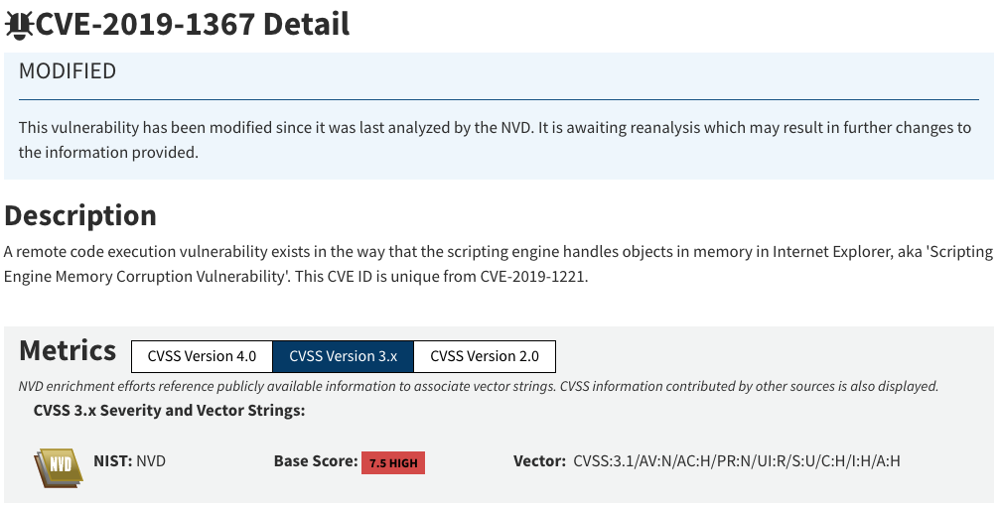

# At the RISK of CVE

## Robert “RSnake” Hansen

---

# About me

- Managing Director – Grossman Ventures
- Former CTO of Bit Discovery
- 30 years in IT Security
- 4 books

---

# Caveat Emptor

- I have not vetted this with MITRE. The data isn't perfectly up to date, though I did write a lot of custom code so that this preso is actually a living document.
- There is a lot going on with this code so it is easy to make mistakes. There are unknown artifacts in the data, modifications under the hood that I may not be aware of, etc.
- I did talk to two CVE board members and the head of EPSS and many researchers who all said it was interesting.
- But anyway, don't take my word for it! Do your own research.

---

# CVE Scoring System Explained


Definition of CVE (Common Vulnerabilities and Exposures) and CVSS (Common Vulnerability Scoring System) [https://github.com/CVEProject/cvelistV5/](https://github.com/CVEProject/cvelistV5/)

How are CVE scores determined via the calculator? Depends on the person.

Components of the CVSS: Base, Temporal, and Environmental scores. Though almost no one I’ve talked to uses temporal or environmental scores.

## By way of example, behold! The Common Fruit Scoring System:

| Name | Edibility | Nutrition | Flavor | Stability | Sweetness | Total |
| :-: | :-: | :-: | :-: | :-: | :-: | :-: |
| Apple | 9.0 | 8.0 | 8.0 | 9.0 | 7.0 | 8.2 |
| Banana | 8.0 | 6.0 | 9.0 | 4.0 | 8.0 | 7.0 |
| Mango | 10.0 | 6.0 | 10.0 | 5.0 | 10.0 | 8.2 |
| Pumpkin | 3.0 | 8.0 | 4.0 | 3.0 | 2.0 | 4.0 |
| Tomato | 7.0 | 6.0 | 7.0 | 4.0 | 3.0 | 5.4 |

---

# Why Does Infosec Spend $200BN a Year and Still Get Hacked Anyway?


---

# Versions Matter (Version 2)


---

# Versions Matter (Version 3)


---

# Naming Inconsistencies

Let's say you want to use CVEs to identify issues in products you have using the name of the vendor "__Red Hat, Inc.__":

* CVE-2017-7559 "vendor": "Red Hat, Inc.",
* CVE-2020-10689 "vendor": "Red Hat",
* CVE-2020-10754 "vendor": "[Red Hat]",
* CVE-2019-10205 "vendor": "RED HAT",
* CVE-2019-10142 "vendor": "RedHat",
* CVE-2019-10150 "vendor": "redhat",
* CVE-2019-10172 "vendor": "Redhat",
* CVE-2022-3841 "vendor": "redhat.com",
* CVE-2019-10201 "vendor": "Red Hat ",

My "favorite" is the last one since there is a space at the end of the vendor name. *sigh*

---

# Missing Data Depending on Exact Match

## Notice there are 11,755 results when I did this search


---

# Missing 2

## Where is CVE-2025-23367? And the other 9,000+ CVEs??


---

# The Data is Confusing



Attack vector is network!? Isn’t it drive by? It’s not a push, it’s a pull.

CVE has no concept of “user interaction is required”.

---

# Scored vs Unscored

## This does not count NVD, because MITRE doesn't count it.


---

# CVE Misses a Lot!

## Examples where there never was a CVE issued:
- Python NaN injection
- Every SQL injection you’ve ever found (huge implications for appsec)
- 40k applications using the same vulnerable library
- Stuff for which they haven’t gotten around to yet…?

---

# Beware!

- CVSS baseScore is overwritten by the CVE Numbering Authority (CNA) in the CVE Project (cve.org – run by MITRE, funded by Homeland Security): [https://github.com/CVEProject/cvelistV5/](https://github.com/CVEProject/cvelistV5/)
- Does not include NVD at all.

```
$ grep -i score CVE-2024-4001.json
"baseScore": 6.4,
```

---

# Numbering Authority Inconsistencies (Who Do You Trust?)


---

# Why Not Include the NVD?


---

# But the NVD Isn't Perfect Either... *sigh*


---

# There is Decent Overlap Between Scoring, But That's Not Necessarily a Good Thing It Turns Out


---

# CVE’s Flagged as “Exploitation”: “Active”


---

# Only Around 6.6% of CVES Have References to Public Exploit Code


---

# Introducing CISA KEV (Known Exploited Vulnerabilities)


---

# KEV Compared to CVE

## “Known Exploited Vulnerabilities” [https://www.cisa.gov/known-exploited-vulnerabilities-catalog](https://www.cisa.gov/known-exploited-vulnerabilities-catalog)
* But what about other vulnerabilities that we know are exploited?
* Shhhhhh… that’s “other known exploited vulnerabilities”
* KEV population/CVE population = ~0.4% - 0.5%
* Said another way, only ~0.4% - 0.5% of vulns currently get exploited, according to CISA, if the KEV means anything. 


... But there is hidden data, left out of KEV.

---

# Average KEV CVSS Scores Make More Sense, Given What They Are


---

# What Is Up with This Distribution?


---

# Some CVSS Scores Are Far More Common Than Others


---

# Density in CVSS Versions 3.0 and 3.1

| Unused CVSS Scores | Rare CVSS scores | Most Common CVSS Scores |
| :-: | :-: | :-: |
| 0.1 | 9.7: 35 CVEs (0.04%) | 7.8: 6,361 CVEs (7.11%) |
| 0.2 | 1.8: 29 CVEs (0.03%) | 7.5: 5,843 CVEs (6.53%) |
| 0.3 | 1.9: 29 CVEs (0.03%) | 6.5: 5,760 CVEs (6.44%) |
| 0.4 | 0.0: 19 CVEs (0.02%) | 8.8: 5161 CVEs (5.77) |
| 0.5 | 9.5: 13 CVEs (0.01%) | 5.3: 5,131 CVEs (5.74%) |
| 0.6 | 1.0: 9 CVEs (0.01%) | 9.8: 4,566 CVEs (5.11%) |
| 0.7 | 1.6: 6 CVEs (0.01%) | 4.3: 4,447 CVEs (4.97%) |
| 0.8 | 1.7: 3 CVEs (0.00%) | 5.4: 3,852 CVEs (4.31%) |
| 0.9 | 1.2: 2 CVEs (0.00%) | 5.5: 2,897 CVEs (3.24%) |
| 1.1 | 1.3: 1 CVEs (0.00%) | 7.1: 2,795 CVEs (3.13%) |
| 1.4 | | |
| 1.5 | | |

This is from 20240327, so this may change a bit but likely it will only look more disproportionate, not more uniform.
You are thousands of times more likely to have a CVSS 7.8 than a 1.3. But... why?

---


- 6.0 + 3.9 = 9.9
- 10.0...  wat?


---

# CVSS 3.x Math

## Base Score=
 - If Impact ≤ 0, then 0
 - Base Score = Roundup( min(1.08 × (Impact + Exploitability), 10))

## A scaling factor of 1.08 is used to give the impact more weight in the final score. But… why?


[https://www.first.org/cvss/v3.1/specification-document](https://www.first.org/cvss/v3.1/specification-document)

---

# Why Can’t We Get CVSS 9.5 in CVE Version 3.x

## Working backwards
 - Score = RoundUp(Min(1.08 · C),10).
 - For the final score to equal 9.5, the unrounded value must lie in the open interval above 9.4 (so it rounds up) but not exceed 9.5. That is, we need
 - 9.4 < 1.08 · C ≤ 9.5.
 - Dividing through by 1.08 gives
 - Impact + Exploitability ∈ (9.4/1.08, 9.5/1.08] ≈ (8.7037, 8.7963].

## In words, for a CVSS score of 9.5 you’d need the sum of Exploitability and Impact to fall somewhere in the very narrow interval (approximately 8.7037, 8.7963).

## The Common Fruit Scoring System is way better... Just saying. 

---

# If CVSS V3 Can’t Be 0.1-1.5 (~14% of the key-space) That Might Account for the Bulk of the Double Digit % Shift


---

# Mathematical Spikes on Certain Numbers Regarding Brute Force Calculation of All Possible Values in CVSS v3

==This is a static graph==


---

# CVSS v3 Favors Certain Values, Eg: 7.8 and 7.5 and Disfavors 0.1-1.5 & 9.5.


---

# A Quick Aside About 2.0 Distribution (the Average Was Better but Overall It Was Worse)

==This is a static graph==


---

# But Here Comes CVSS 4.0… Annnnd Also More v3.1…?


---

# What in the Name of CVSS 4.0 Is Going On?

==This is a static graph==


---

# Density Probability Is 14% Better with CVSS V4 Than v3

==This is a static graph==


---

# Yet the Complexity of 4.0 Is Much Higher to Get Fewer Possibilities

==This is a static graph==


---

# A Curious Increasing Middling?


---

# And a Decreasing Criticality (a Different View of the Same Data)


---

# Quick Aside About the CVSS 0.0 Scores...


---

# Worse Yet! Critical CVE Analysis (CVSS >= 9.0):


---

# KEV Breakdown per Year (Notice Nothing Before 2002)


---

# Percentage Distribution of CVSS Scores in CISA KEV List


What is up with those lows...?

---

# How is that possible? I give you the CNA (CVE numbering authorities)


---

# CNA Incentives vs NVD Incentives

Who do you trust? The NVD who historically overestimates the vulns?

__OR__

The CNA who is incentivized to reduce the risk score so that people don’t think their product is garbage?  At least the CNAs are hopefully going to catch up and score all those old vulns, right?

Neither of them seem to be based in real-world evidence, or they wouldn't diverge so much.

---

# RAW # of Unscored CVEs and KEVs over the Years (Not NVD)


---

# The CNAs Do Appear to Be Working (NVD Should Be Added)


---

# Publication Delays


---

# Easier to See on Log Scale


---

# CVEs Are Outdated in Some Cases – 16 Years at Worst


---

# Is KEV Outdated?

For a variety of reasons, KEV is an incredibly lagging indicator of active exploitation.

So, you must augment it if you want to stop breaches.

It’s delayed 18 months in some cases.

---

# Vulncheck KEV vS CISA KEV


---

# Vulncheck KEV CVSS via CISA ADP/CNA


---

# The Problem with CVE “Stoplight” Infosec Math


* Let’s say you have a CVE of 1.  That is 1/10th the value of the number 10.  So, it stands to reason a CVE of 10 is ten times worse.
  * That’s math. 
  * You know... the thing the CFOs and the Board and the rest of the business, like sales and marketing use.
* If the full replacement cost of a laptop is $1,000 and the CVSS on it is a 1, are you trying to tell me that the worst vulnerability in the world can only be $10,000? Huh??
  * That’s not good math, folks. Do not try this with a CFO/CPA/Insurance broker/Board member.

---

# CISA is Vulnerable and Incorrect

Look at that .exe link on [https://labs.watchtowr.com/8-million-requests-later-we-made-the-solarwinds-supply-chain-attack-look-amateur/](https://labs.watchtowr.com/8-million-requests-later-we-made-the-solarwinds-supply-chain-attack-look-amateur/) Feb 4, 2025


---

# CISA is Vulnerable and Incorrect (2)

Oh, good CISA hasn't updated the page since 2013...


---

# CISA is Vulnerable and Incorrect (3)

Wait, where is that .exe?!


CISA changed it without telling anyone.

---

# Disputed CVEs Aren’t Removed


--- 

# Disputed Vulns by Year (None Before 2001)


---

# But Wait, There’s also Rejected!


---

# EPSS Also Gets That Wrong


---

# EPSS Doesn't Agree with CVSS at All


---

# It's not even a flip of the coin @ > 50% difference


---


## Claims:
1. Not a measure of risk – a measure of “severity”
2. Well suited for people who need “accuracy” and “consistency”
3. Used as a factor of prioritization for remediation

[https://nvd.nist.gov/vuln-metrics/cvss](https://nvd.nist.gov/vuln-metrics/cvss)

---

# The So What…

> “Based on the anonymized customer data we are observing, CISA’s KEV Catalog is a cornerstone of collective defense, helping security teams swiftly identify, prioritize, and address critical threats. CISA’s proactive sharing of these risks fosters unity and keeps defenders ahead. Notably, many organizations respond promptly to newly listed KEVs, and vulnerabilities are remediated faster when they are in CISA KEV list.” - Qualys

Netsec/Appsec is doomed if you rely on CVSS alone. We’re working on too much that doesn’t matter. We need to start thinking about the vulns that lead to verifiable loss, not the ones that are never exploited.  We need  *evidence-based*  risk.  __We need ROSI__!

CVSS != Risk in the same way CFSS != Fruit

---

# Q&A

Robert “RSnake” Hansen - Managing Director 

Work: [Grossman Ventures](https://grossman.vc/) 
Me: [https://rsnake.com/](https://rsnake.com/)
The data: [https://cvedata.com/](https://cvedata.com/)